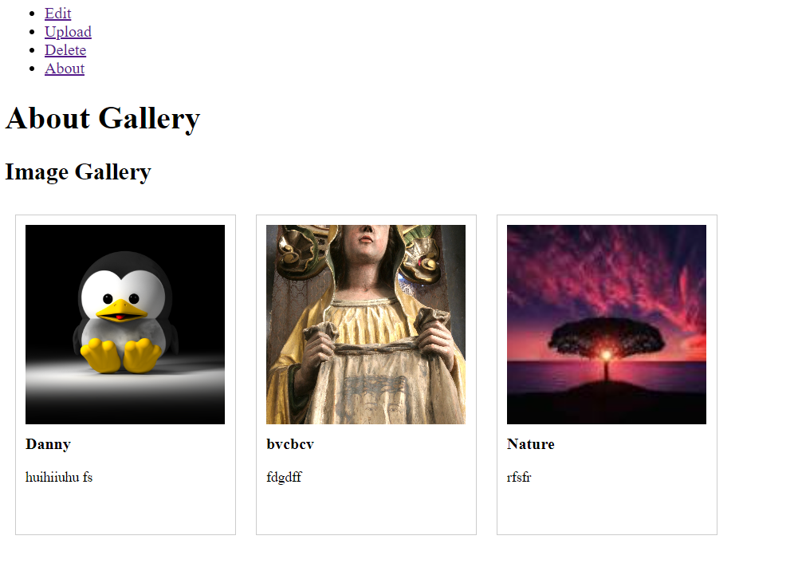
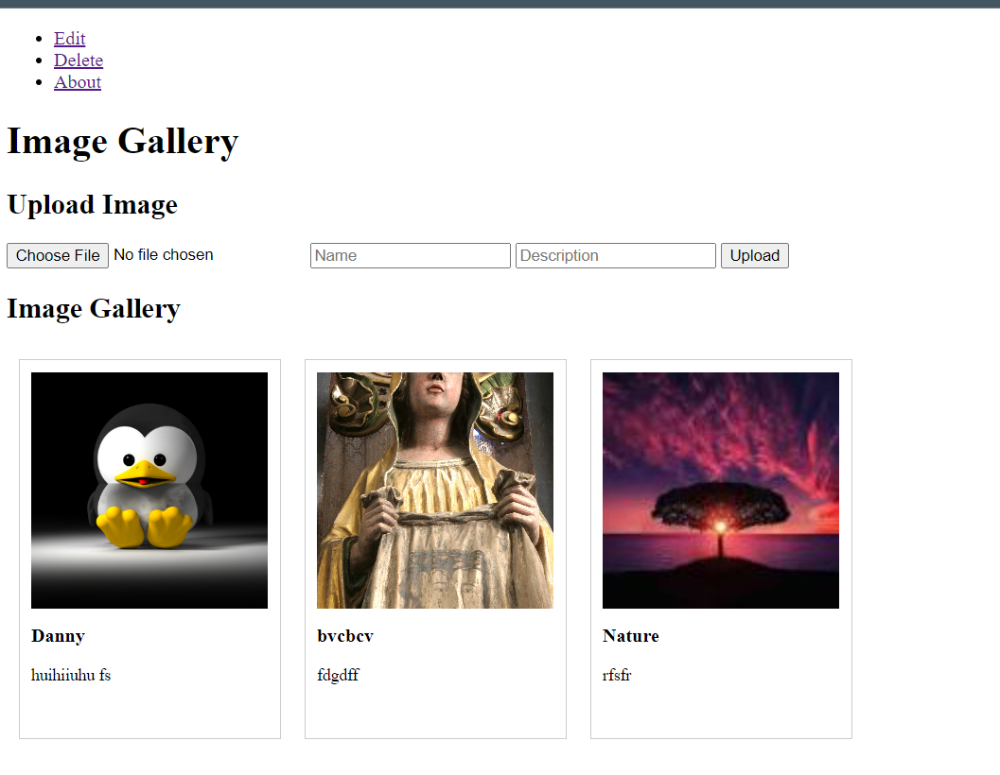
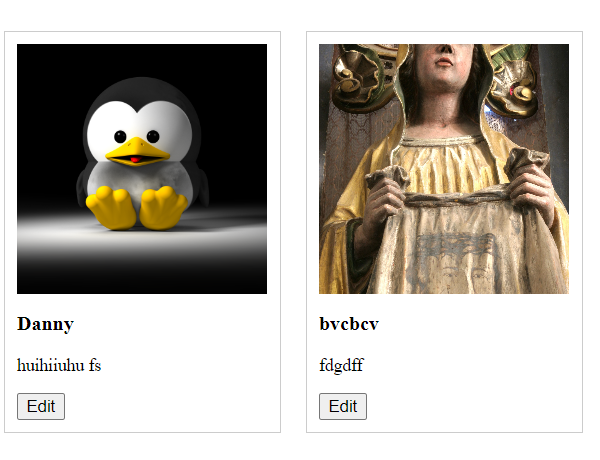

# My Images blog-repo

## Description

App builts with Javascript HTML and CSS that store pictures locally, where users can store, view , update and delete pictures or descriptions

## Social Network images storage 
view saved pictures and rewatch your memories

## Navigation

* CRUD Navaigation create on 4 pages using local Storage and JavaScript DOM queries
  * About page (Home)  - Navigation plus view some Cards
  * Edit page          - Navigation plus edit Card
  * Upload page        - Navigation plus add image through a form
  * Delete page        - Navigation plus delete card

## About Page

## Upload Page

## Edit Page

## Delete Page

